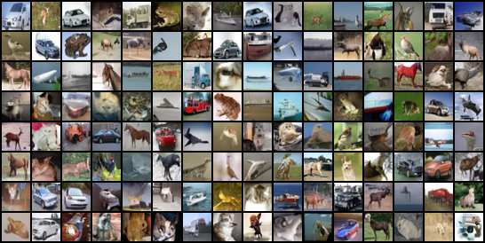
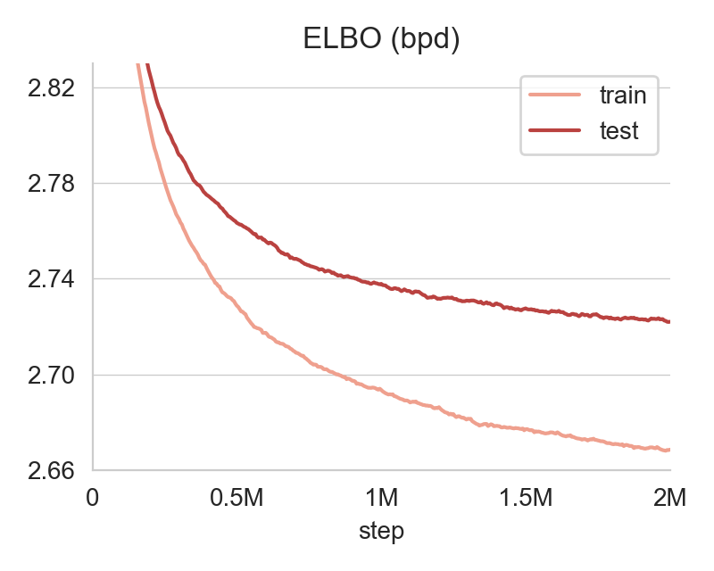
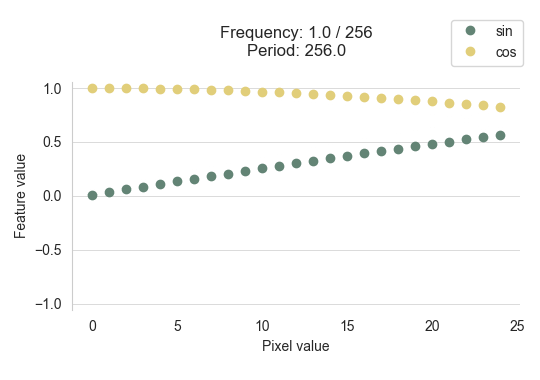

# Variational Diffusion Models (VDM)

This is a PyTorch implementation of [Variational Diffusion Models](https://arxiv.org/abs/2107.00630), 
where the focus is on optimizing *likelihood rather than sample quality*, 
in the spirit of *probabilistic* generative modeling.

This implementation should match the 
[official one](https://github.com/google-research/vdm) in JAX. 
However, the purpose is mainly educational and the focus is on simplicity.
So far, the repo only includes CIFAR10, and variance minimization 
with the $\gamma_{\eta}$ network (see Appendix `I.2` in the paper) is not 
implemented (it's only used for CIFAR10 *with augmentations* and, according 
to the paper, it does not have a significant impact).


## Results

The samples below are from a model trained on CIFAR10 for 2M steps with a fixed noise 
schedule such that $\log \mathrm{SNR}(t)$ is linear, with $\log \mathrm{SNR}(0) = 13.3$ and $\log \mathrm{SNR}(1) = -5$.
These samples are generated from the EMA model in 1000 denoising steps.

<p align="center">

</p>

The test set variational bound is 2.72 bpd after 2M steps (the paper reports 2.65 after 10M steps). Smoothed training curves below.

<p align="center">

</p>


## Overview of the model

### Diffusion process

Let $\mathbf{x}$ be a data point, $\mathbf{z}_t$ the latent variable at time $t \in [0,1]$, and

$$\sigma^2_t = \mathrm{sigmoid}(\gamma_t)$$

$$\alpha^2_t = 1 - \sigma^2_t = \mathrm{sigmoid}(-\gamma_t)$$

with $\gamma_t$ the negative log SNR at time $t$.
Then the forward diffusion process is:

$$q\left(\mathbf{z}_t \mid \mathbf{x}\right)=\mathcal{N}\left(\alpha_t \mathbf{x}, \sigma_t^2 \mathbf{I}\right)$$


### Reverse generative process

In discrete time, the generative (denoising) process in $T$ steps is

$$p(\mathbf{x})=\int_{\mathbf{z}} p\left(\mathbf{z}_1\right) p\left(\mathbf{x} \mid \mathbf{z}_0\right) \prod_{i=1}^T p\left(\mathbf{z}_{s(i)} \mid \mathbf{z}_{t(i)}\right)$$

$$p(\mathbf{z}_1) = \mathcal{N}(\mathbf{0}, \mathbf{I})$$

$$p(\mathbf{x} \mid \mathbf{z}_0) = \prod_{i=1}^N p(x_i \mid z_{0,i})$$

$$p(x_i \mid z_{0,i}) \propto q(z_{0,i} \mid x_i)$$

where $s(i) = \frac{i-1}{T}$ and $t(i) = \frac{i}{T}$.
We then choose the one-step denoising distribution to be equal to the 
true denoising distribution given the data (which is available in 
closed form) except that we substitute the unavailable data
with a prediction of the clean data at the previous time step:

$$p\left(\mathbf{z}_s \mid \mathbf{z}_t\right)=q\left(\mathbf{z}_s \mid \mathbf{z}_t, \mathbf{x}=\hat{\mathbf{x}}_\theta\left(\mathbf{z}_t ; t\right)\right)$$

where $\hat{\mathbf{x}}_\theta$ is a denoising model with parameters $\theta$.


### Optimization in continuous time

The loss function is given by the usual variational lower bound:

$$-\log p(\mathbf{x}) \leq-\operatorname{VLB}(\mathbf{x})=D_{KL}\left(q\left(\mathbf{z}_1 \mid \mathbf{x}\right)\ ||\ p\left(\mathbf{z}_1\right)\right)+\mathbb{E}_{q\left(\mathbf{z}_0 \mid \mathbf{x}\right)}\left[-\log p\left(\mathbf{x} \mid \mathbf{z}_0\right)\right]+\mathcal{L}_T(\mathbf{x})$$

where the diffusion loss $\mathcal{L}_T(\mathbf{x})$ is

$$\mathcal{L}_T (\mathbf{x}) = \sum_{i=1}^T \mathbb{E}_{q \left(\mathbf{z}_t \mid \mathbf{x}\right)} D_{KL}\left[q\left(\mathbf{z}_s \mid \mathbf{z}_t, \mathbf{x}\right)\ ||\ p\left(\mathbf{z}_s \mid \mathbf{z}_t \right)\right]$$

Long story short, using the classic noise-prediction parameterization of the denoising model:

$$\hat{\mathbf{x}}_\theta\left(\mathbf{z}_t ; t\right) = \frac{\mathbf{z}_t-\sigma_t \hat{\boldsymbol{\epsilon}}_\theta\left(\mathbf{z}_t ; t\right)}{\alpha_t}$$

and considering the continuous-time limit ($T \to \infty$), 
the diffusion loss simplifies to:

$$\mathcal{L}_{\infty}(\mathbf{x})=\frac{1}{2} \mathbb{E}_{\boldsymbol{\epsilon} \sim \mathcal{N}(0, \mathbf{I}), t \sim \mathcal{U}(0,1)}\left[ \frac{d\gamma_t}{dt} \  \|\| \boldsymbol{\epsilon}-\hat{\boldsymbol{\epsilon}}_{\boldsymbol{\theta}}\left(\mathbf{z}_t ; t\right) \|\| _2^2\right]$$


### Fourier features

One of the key components to reach SOTA likelihood is the 
concatenation of Fourier features to $\mathbf{z}_t$ before feeding it into the 
UNet. For each element $z_t^i$ of $\mathbf{z}_t$ (e.g., one channel of 
a specific pixel), we concatenate:

$$f_n^{i} = \sin \left(2^n z_t^{i} 2\pi\right)$$

$$g_n^{i} = \cos \left(2^n z_t^{i} 2\pi\right)$$

with $n$ taking a set of integer values.
  
Assume that each scalar variable takes values:

$$\frac{2k + 1}{2^{m+1}} \ \text{ with }\ k = 0, ..., 2^m - 1  \ \text{ and }\ m \in \mathbb{N}.$$

E.g., in our case the $2^m = 256$ pixel values are $\left\\{\frac{1}{512}, \frac{3}{512}, ..., \frac{511}{512} \right\\}$.
The argument of $\sin$ and $\cos$ is then

$$\frac{2k + 1}{2^m} 2^n \pi = 2^{n-m} \pi +  2\pi 2^{n-m}k$$

which means the features have period $2^{m-n}$ in $k$.
Therefore, at very high SNR (i.e., almost discrete values with negligible noise), where 
Fourier features are expected to be most useful to deal with fine details, we should choose 
$n < m$, such that the period is greater than 1.
For the cosine, the condition is even stricter, because if $n = m-1$ then 
$g_n^i = \cos\left(\frac{\pi}{2} + k\pi\right) = 0$.
Since in our case $m=8$, we take $n \leq 7$.
In the code we use $n \leq 6$ because images have twice the range 
(between $\pm \frac{255}{256}$).

Below we visualize the feature values for pixel values 0 to 25, varying the 
frequency $2^n$ with $n$ from 0 to 7. At $n=m-1=7$, the cosine features are constant, 
and the sine features measure the least significant bit of the pixel value.
On clean data, any frequency $2^n$ with $n$ integer and $n > 7$ would 
be useless (1 would be a multiple of the period).

<p align="center">

</p>

Below are the sine features on the Mandrill image (and detail on the right) with smoothly increasing frequency 
from $2^0$ to $2^{4.5}$.

<p align="center">

</p>


## Setup

The environment can be set up with `requirements.txt`. For example with conda:

```
conda create --name vdm python=3.9
conda activate vdm
pip install -r requirements.txt
```


## Training with  🤗 Accelerate

To train with default parameters and options:

```bash
accelerate launch --config_file accelerate_config.yaml train.py --results-path results/my_experiment/
```

Append `--resume` to the command above to resume training from the latest checkpoint. 
See [`train.py`](train.py) for more training options.

Here we provide a sensible configuration for training on 2 GPUs in the file 
[`accelerate_config.yaml`](accelerate_config.yaml). This can be modified directly, or overridden 
on the command line by adding flags before "`train.py`" (e.g., `--num_processes N` 
to train on N GPUs).
See the [Accelerate docs](https://huggingface.co/docs/accelerate/index) for more configuration options.
After initialization, we print an estimate of the required GPU memory for the given 
batch size, so that the number of GPUs can be adjusted accordingly.
The training loop periodically logs train and validation metrics to a JSONL file,
and generates samples.


## Evaluating from checkpoint

```bash
python eval.py --results-path results/my_experiment/ --n-sample-steps 1000
```


## Credits

This implementation is based on the VDM [paper](https://arxiv.org/abs/2107.00630) and [official code](https://github.com/google-research/vdm). The code structure for training diffusion models with Accelerate is inspired by [this repo](https://github.com/lucidrains/denoising-diffusion-pytorch).
